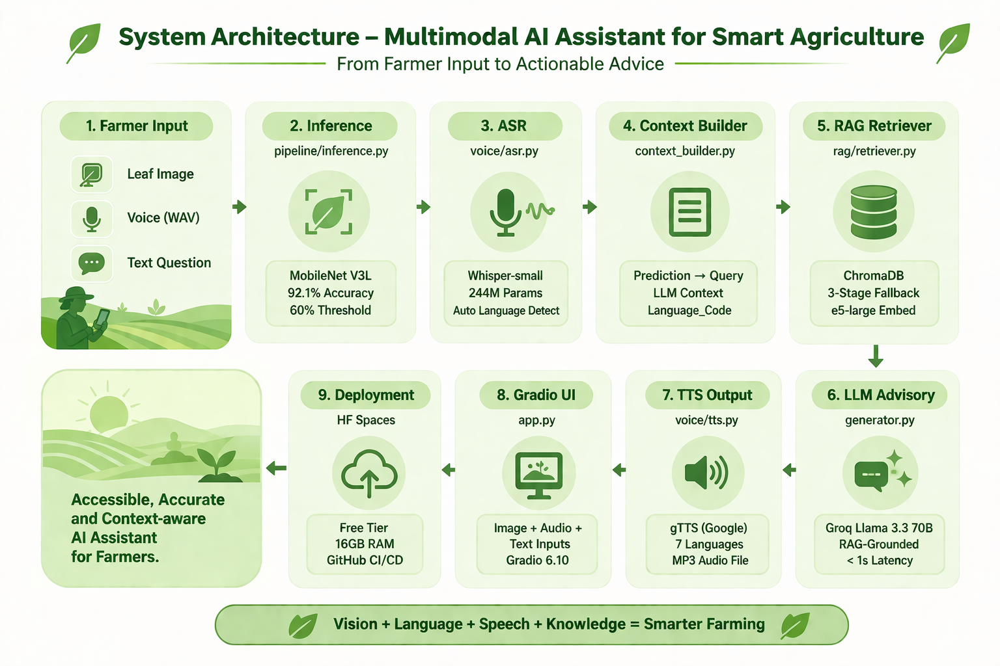

# 🌾 Crop Disease AI Assistant
Multimodal AI Assistant for Smart Agriculture — Indian Farming Conditions

This application is hosted on HF Spaces: [LINK](https://huggingface.co/spaces/harishsahadev/crop-disease-assistant)

## Project Structure
```
crop-disease-assistant/
├── app.py                        ← Gradio entry point (HF Space)
├── requirements.txt
├── model/
│   └── mobilenet.pth             ← Your trained model (add this)
├── pipeline/
│   ├── inference.py              ← MobileNet prediction
│   ├── context_builder.py        ← Prediction → RAG query
│   └── generator.py              ← Groq LLM response
├── rag/
│   ├── ingest.py                 ← Run once to build ChromaDB index
│   ├── retriever.py              ← Query ChromaDB
│   ├── docs/                     ← Add your agricultural PDFs here
│   └── chroma_db/                ← Auto-generated by ingest.py
└── voice/
    ├── asr.py                    ← Whisper speech-to-text
    └── tts.py                    ← gTTS text-to-speech
```

## System Architecture

The assistant integrates MobileNet for disease prediction, ChromaDB for document retrieval, and Groq for LLM response generation, all accessible via a Gradio interface with voice capabilities powered by Whisper and gTTS.



## Setup Steps

### 1. Add your model
Copy your trained `.pth` file to `model/mobilenet.pth`.
Then open `app.py` and update:
```python
MODEL_NAME    = "mobilenet_v2"   # or 'mobilenet_v3_large' — check best_metrics.json
MODEL_DROPOUT = 0.2              # check best_metrics.json → best_params → dropout
```

### 2. Add agricultural documents
Place PDFs/TXTs in `rag/docs/` using this naming format:
```
{crop}_{disease}_{source}.pdf
```
Examples:
- `rice_brown_spot_icar.pdf`
- `corn_gray_leaf_spot_tnau.pdf`
- `wheat_yellow_rust_fao.pdf`
- `potato_late_blight_icar.pdf`
- `sugarcane_red_rot_icar.pdf`

**Recommended sources:**
- ICAR: https://icar.org.in → Publications
- TNAU Agritech: https://agritech.tnau.ac.in → Crop Protection
- DACFW: https://agricoop.gov.in
- FAO: https://fao.org (search "crop disease management PDF")

### 3. Build the ChromaDB index
```bash
pip install -r requirements.txt
python rag/ingest.py
```
This creates `rag/chroma_db/` — commit this folder to your repo.

### 4. Set environment variables
```bash
export GROQ_API_KEY=your_key_here
```
Get a free key at: https://console.groq.com

### 5. Run locally
```bash
python app.py
```

## Deploy to Hugging Face Spaces

1. Create a new Space at huggingface.co → New Space → Gradio SDK
2. Push this repo to the Space (or connect your GitHub repo)
3. Go to Space Settings → Secrets → Add `GROQ_API_KEY`
4. Space will auto-build from `requirements.txt`

**Important for HF Spaces:**
- Keep `whisper-small` (not medium/large) to stay within 16GB RAM
- The `chroma_db/` folder must be committed to the repo OR regenerate at startup

## Crops & Diseases Supported
| Crop | Diseases |
|------|----------|
| Corn | Common Rust, Gray Leaf Spot, Northern Leaf Blight, Healthy |
| Potato | Early Blight, Late Blight, Healthy |
| Rice | Brown Spot, Leaf Blast, Neck Blast, Healthy |
| Wheat | Brown Rust, Yellow Rust, Healthy |
| Sugarcane | Red Rot, Bacterial Blight, Healthy |

## Languages Supported
Hindi, Bengali, Tamil, Telugu, Malayalam, Kannada, English
