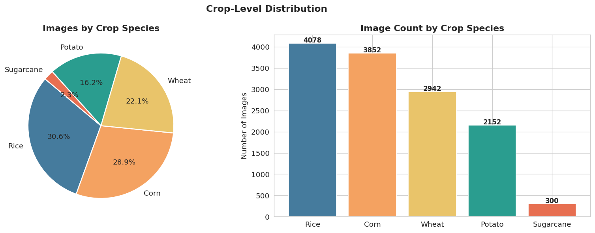
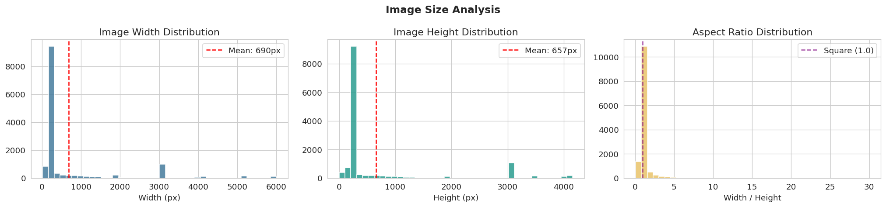
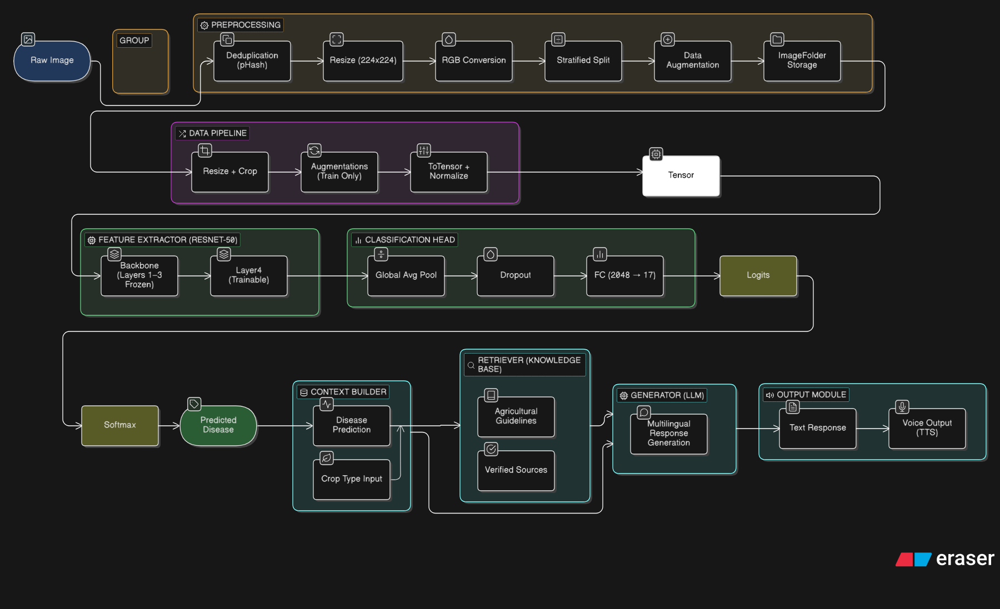
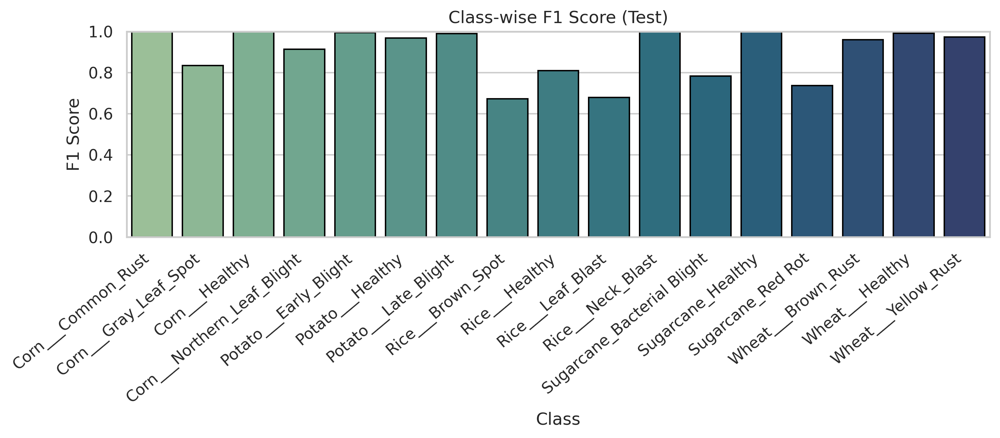
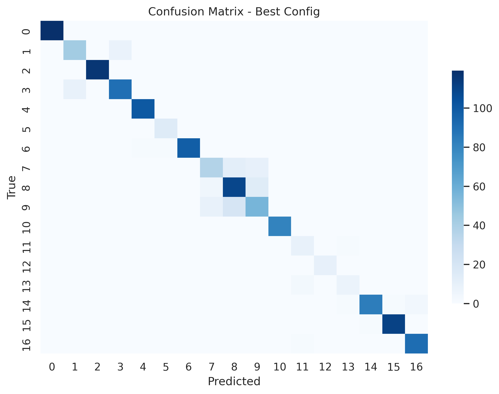
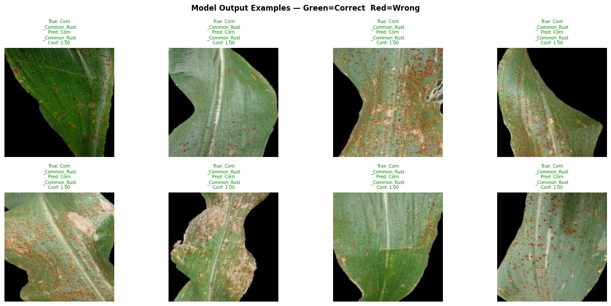

# Final Technical Report
## Multimodal AI Assistant for Smart Agriculture
**Crop Disease Detection · RAG Advisory · Multilingual Voice Interface**

---

## 1. Introduction & Problem Definition

### 1.1 Background

Agriculture employs over 40% of India's workforce and forms the backbone of the rural economy. Despite this, smallholder and marginal farmers — who cultivate the majority of India's agricultural land — have extremely limited access to timely, accurate agronomic guidance. When a crop disease strikes, the window for effective intervention is narrow: diseases such as Late Blight in potatoes, Leaf Blast in rice, and Common Rust in corn can spread across an entire field within days if not identified and treated early. The cost of a misdiagnosis or delayed diagnosis is not an abstract metric — it is a destroyed harvest and a season's income lost.

Existing digital agricultural advisory solutions fail this population in several compounding ways. Most platforms are designed in English, assuming a level of literacy and language familiarity that the target user base does not have. Cloud-dependent architectures assume stable internet connectivity that rural Indian environments cannot guarantee. AI chatbot-based systems generate recommendations from general-purpose training data with no mechanism to verify that the pesticide, dosage, or treatment protocol they recommend is accurate, region-appropriate, or currently approved for use in India.

### 1.2 Problem Statement

No unified system existed that combined all of the following in a single, deployable application:

- Real-time visual identification of crop diseases from leaf photographs
- Retrieval-grounded advisory responses tied to verified agricultural documents
- Multilingual interaction supporting major Indian regional languages
- Voice-based input and output for users with low text literacy
- Deployment on zero-cost, CPU-only infrastructure accessible in low-connectivity settings

This project addresses all five gaps in a single integrated pipeline, designed and built across five milestones from problem definition through live deployment.

### 1.3 Objectives

**Primary Objective:** Design and develop a deep learning-based multimodal system that detects crop diseases from leaf images and provides grounded, multilingual, voice-enabled agricultural guidance.

**Secondary Objectives:**
- Achieve ≥ 85–90% classification accuracy and strong Macro F1 across 17 disease classes
- Implement Retrieval-Augmented Generation (RAG) to ground every advisory response in verified documents, eliminating hallucination
- Support six Indian regional languages: Hindi, Bengali, Tamil, Telugu, Malayalam, and Kannada
- Integrate automatic speech recognition (ASR) and text-to-speech (TTS) for full voice interaction
- Deploy the complete system at zero infrastructure cost on CPU-only free-tier hosting

---

## 2. Key Features

| Feature | Description | Farmer Benefit |
|---------|-------------|----------------|
| Crop Disease Detection | Classifies 17 disease and health categories across 5 crops from a single leaf photo; flags predictions below the 0.60 confidence threshold | Instant disease identification without waiting for an agricultural officer or expert visit |
| RAG-Grounded Advisory | Retrieves verified treatment and prevention guidance from documents; LLM generates a response strictly from retrieved content | Trustworthy, locally relevant advice — every recommendation is traceable to a verified source; no hallucinated pesticide names or dosages |
| Multilingual Support | Full pipeline in Hindi, Bengali, Tamil, Telugu, Malayalam, Kannada, and English | Accessible to farmers regardless of language or literacy level in English |
| Voice Input & Output | Whisper ASR transcribes spoken questions with automatic language detection; gTTS reads responses aloud | Farmer can speak a question in their mother tongue and hear the answer — no typing or reading required |
| Confidence Thresholding | Predictions below 0.60 confidence trigger cautious advisory mode and recommend KVK consultation | Prevents the system from giving specific treatment advice when it is uncertain — a critical safety mechanism |

---

## 3. Dataset & Exploratory Data Analysis 

### 3.1 Dataset Overview

**Dataset:** Top Agriculture Crop Disease — Kaggle (kamal01)

| Property | Value |
|----------|-------|
| Total Images | 13,324 |
| Classes | 17 (disease and health categories) |
| Crops Covered | Corn (4 classes), Potato (3), Rice (4), Wheat (3), Sugarcane (3) |
| Image Format | JPEG / PNG, RGB |
| Image Resolution Range | 16×1 px to 6,000×4,160 px (mean ≈ 690×657 px) |
| Class Imbalance Ratio | 14.9× (Rice___Healthy: 1,488 images vs Sugarcane classes: 100 each) |

The dataset aggregates images from multiple sources, each with different imaging conditions:

- **Corn and Potato** — sourced from PlantVillage, the most widely used benchmark for plant disease classification. Images are controlled lab photographs on uniform backgrounds at fixed resolution.
- **Rice** — sourced from the Bangladeshi Dhan-Shomadhan dataset (CC BY 4.0) combined with the Kaggle Rice Leafs dataset. Images include natural backgrounds and variable lighting conditions.
- **Wheat** — sourced from the Kaggle Wheat Disease Detection dataset. Real-field photographs with varying backgrounds, lighting, and leaf orientations.
- **Sugarcane** — sourced from the Kaggle Sugarcane Disease Dataset. The most severely under-represented crop with only 100 images per class; field photographs with mixed backgrounds.

### 3.2 Class-wise Distribution

| # | Class Label | Images | Crop | Source |
|---|-------------|--------|------|--------|
| 1 | Corn___Common_Rust | 1,192 | Corn | PlantVillage |
| 2 | Corn___Gray_Leaf_Spot | 513 | Corn | PlantVillage |
| 3 | Corn___Healthy | 1,162 | Corn | PlantVillage |
| 4 | Corn___Northern_Leaf_Blight | 985 | Corn | PlantVillage |
| 5 | Potato___Early_Blight | 1,000 | Potato | PlantVillage |
| 6 | Potato___Healthy | 152 | Potato | PlantVillage |
| 7 | Potato___Late_Blight | 1,000 | Potato | PlantVillage |
| 8 | Rice___Brown_Spot | 613 | Rice | Dhan-Shomadhan + Rice Leafs (Kaggle) |
| 9 | Rice___Healthy | 1,488 | Rice | Dhan-Shomadhan + Rice Leafs (Kaggle) |
| 10 | Rice___Leaf_Blast | 977 | Rice | Dhan-Shomadhan + Rice Leafs (Kaggle) |
| 11 | Rice___Neck_Blast | 1,000 | Rice | Dhan-Shomadhan + Rice Leafs (Kaggle) |
| 12 | Wheat___Brown_Rust | 902 | Wheat | Wheat Disease Detection (Kaggle) |
| 13 | Wheat___Healthy | 1,116 | Wheat | Wheat Disease Detection (Kaggle) |
| 14 | Wheat___Yellow_Rust | 924 | Wheat | Wheat Disease Detection (Kaggle) |
| 15 | Sugarcane__Red_Rot | 100 | Sugarcane | Sugarcane Disease Dataset (Kaggle) |
| 16 | Sugarcane__Healthy | 100 | Sugarcane | Sugarcane Disease Dataset (Kaggle) |
| 17 | Sugarcane__Bacterial_Blight | 100 | Sugarcane | Sugarcane Disease Dataset (Kaggle) |



### 3.3 Key EDA Findings

**Class Imbalance:**
The most populated class (Rice___Healthy, 1,488 images) has 14.9× more images than the least populated classes (all three Sugarcane classes, 100 images each). Secondary imbalances also exist within crops: Potato___Healthy (152 images) and Corn___Gray_Leaf_Spot (513 images) are significantly under-represented relative to other classes in their respective crops. Without mitigation, a model trained on this raw distribution would be biased toward majority classes and would perform poorly on minority classes — overall accuracy could appear high while Sugarcane detection completely fails.

**Resolution Variability:**
Images span a range from 16×1 pixels to 6,000×4,160 pixels, reflecting the fundamentally different imaging conditions across source datasets. PlantVillage images are fixed-resolution controlled lab photographs; Kaggle field datasets are variable-resolution real-world photographs. This extreme range makes a uniform resize step mandatory before any model training.



**Data Quality:**
All 13,324 images were verified using PIL's `verify()` method — 0 corrupt files detected. MD5 cryptographic hashing was applied to every image — 0 exact duplicates detected. Perceptual hashing (pHash) was applied to a 500-image sample — 2 near-duplicate pairs detected, scheduled for removal during preprocessing.

**Color Channel Analysis:**
Pixel intensity analysis across a stratified 500-image sample confirmed that the green channel consistently shows higher mean intensity in healthy leaf images across all crops. Diseased classes show measurably lower green channel intensity, confirming that color shift is a key discriminative feature between healthy and diseased leaves and that RGB color information carries significant diagnostic signal.

---

## 4. Preprocessing Pipeline 

Preprocessing was designed based directly on the EDA findings above. All steps were applied prior to training and the output was saved in an ImageFolder-compatible directory structure for direct loading during model training.

### 4.1 Pipeline Steps

| Step | Technique | Justification |
|------|-----------|---------------|
| Resize | 224×224 px (LANCZOS interpolation) | Standard input size for all major pretrained CNN architectures. LANCZOS was chosen over bilinear for its superior quality when downscaling from extreme resolutions (e.g., 6,000px → 224px). |
| RGB Conversion | Forced 3-channel conversion | EDA confirmed all images are RGB; step retained as a safety measure to prevent pipeline crashes on any edge-case images encountered during batch loading. |
| Duplicate Removal | MD5 hashing (exact) + pHash (near-duplicate, threshold ≤ 5) | Prevents data leakage between train and test splits. Identical or near-identical images in both sets would artificially inflate test accuracy. |
| Corrupt File Removal | PIL verify() check | 0 corrupt files found in EDA; check retained in pipeline to prevent silent runtime crashes during batch training. |
| Augmentation | Applied to minority classes only — target ~700 images per class | Addresses 14.9× imbalance without collecting new data. Augmentation is applied only to training images; never to validation or test sets. |
| Normalization | ImageNet mean = [0.485, 0.456, 0.406], std = [0.229, 0.224, 0.225] | All candidate models were pretrained on ImageNet. Using the same normalization ensures pretrained weights are directly applicable without distribution shift. |
| Train/Val/Test Split | Stratified 80/10/10 split, seed = 42 | Stratification ensures all 17 classes — including the smallest Sugarcane classes with only 100 images — are proportionally represented in every subset. |

### 4.2 Augmentation Strategy

Augmentation was targeted at classes significantly below the dataset mean: Sugarcane classes (100 → ~700), Potato___Healthy (152 → ~700), and Corn___Gray_Leaf_Spot (513 → ~700). The following transforms were applied:

- **Horizontal and vertical flip** — simulates different leaf orientations without altering disease appearance
- **Random rotation (0°/90°/180°/270°)** — accounts for camera angle variability in field photography
- **Brightness, contrast, and saturation adjustment (±20–30%)** — simulates varying lighting conditions between lab and real-field images
- **Random zoom crop (±15%)** — simulates varying camera-to-leaf distances

Augmentation was strictly confined to the training set. Applying augmentation to validation or test sets would artificially improve reported metrics and misrepresent actual model performance on real-world inputs.

### 4.3 Train/Val/Test Split

| Split | Size | Purpose |
|-------|------|---------|
| Training (80%) | ~10,659 images | Model weight updates during training |
| Validation (10%) | ~1,332 images | Hyperparameter tuning, early stopping, Optuna objective |
| Test (10%) | ~1,333 images | Held out; used only for final model evaluation in M5 |

---

## 5. Model Architecture 

### 5.1 Architecture Selection

The architecture search treated model family as a categorical hyperparameter within the Optuna HPO framework. Two candidates were evaluated: MobileNet V2 (3.4M parameters) and MobileNet V3 Large (5.4M parameters). ResNet-50 was considered as a baseline (~25.6M parameters) but ruled out prior to HPO — its parameter count is approximately 5× larger than MobileNet architectures, making it too memory-intensive for the CPU-only, free-tier deployment target with only marginal accuracy gains on a 13K image dataset.

**Why MobileNet architectures:** MobileNets use depthwise separable convolutions — factoring a standard convolution into a depthwise spatial convolution (applied per channel) followed by a pointwise 1×1 convolution (combining channels). This reduces computation by approximately 8–9× compared to standard convolutions while retaining comparable representational capacity, making them well-suited for CPU inference.

**Why MobileNet V3 Large over V2:** MobileNet V3 Large introduces Squeeze-and-Excitation (SE) blocks — channel-wise attention mechanisms that compute a global summary of each feature map, pass it through two fully connected layers, and use the output to rescale each channel's activations. For crop disease classification, where discriminative features (lesion color, texture, shape, border characteristics) occupy specific spatial regions of a leaf image, SE attention provides meaningful benefit by learning which feature channels are most informative for a given input.

### 5.2 Model Structure

```
Input: (N, 3, 224, 224)  — RGB, ImageNet-normalized
    ↓
MobileNet V3 Large Backbone (frozen — ImageNet pretrained weights)
  ├── Depthwise Separable Convolution Blocks
  └── Squeeze-and-Excitation (SE) Attention Blocks
    ↓
AdaptiveAvgPool2d → Flatten → (N, 960)
    ↓
Linear(960, 1280) + Hardswish activation
    ↓
Dropout(p = 0.4704)   ← Optuna-tuned
    ↓
Linear(1280, 17)      ← Replaced classification head (17 disease/health classes)
    ↓
Softmax → (predicted_class, confidence_score)
```



### 5.3 Transfer Learning & Fine-Tuning Strategy

All backbone layers were frozen (`requires_grad = False`). Only the replacement classifier head was trained. This approach is justified by two considerations:

1. **Preventing catastrophic forgetting:** ImageNet features — edges, textures, color gradients, shapes — are directly applicable to leaf disease classification. Unfreezing the backbone risks overwriting these general-purpose features with task-specific ones that overfit on the relatively small 13K dataset.
2. **Reducing trainable parameters:** Frozen backbone means only ~2.5M parameters are trainable (the classifier head), dramatically reducing overfitting risk and compute required per training step.

---

## 6. Training & Hyperparameter Optimization 

### 6.1 Loss Function

`CrossEntropyLoss` was used as the training objective. Class imbalance was addressed at the data level through augmentation rather than loss weighting (e.g., focal loss). Augmentation brings minority classes to approximately equal sample counts in the training set, meaning the model sees roughly balanced batches during training without requiring the loss function to compensate — producing more interpretable training dynamics.

### 6.2 Evaluation Metric: Macro F1

Macro F1 was chosen as the primary evaluation metric and the Optuna optimization objective over accuracy. With a 14.9× class imbalance, a model that correctly classifies all majority class images but completely fails on Sugarcane classes could still achieve approximately 85% accuracy — a misleadingly high number. Macro F1 computes F1 independently for each of the 17 classes and takes their unweighted average, giving equal weight to Sugarcane classes (2.3% of data) as to Rice classes (30.6%). This forces the model to learn minority class features rather than ignoring them.

### 6.3 Optuna Hyperparameter Search

Optuna's Tree-structured Parzen Estimator (TPE) sampler was used. Unlike grid search (exponential cost) or random search (no learning between trials), TPE builds a probabilistic model of which hyperparameter regions produce good results based on completed trials and samples preferentially from promising regions. `MedianPruner` terminated trials early if their validation Macro F1 fell below the median across all trials completed to that point — Trial 3 was pruned on this basis.

**Hyperparameter search space:**
- Model architecture: {MobileNet V2, MobileNet V3 Large}
- Optimizer: {Adam, AdamW, SGD}
- Learning rate: log-uniform [1e-5, 1e-3]
- Dropout rate: uniform [0.0, 0.5]
- Batch size: {16, 32}
- Weight decay: log-uniform [1e-6, 1e-3]

### 6.4 Optuna Trial Results

| Trial | Architecture | Optimizer | LR | Dropout | Batch | Val Macro F1 | Status |
|-------|-------------|-----------|-----|---------|-------|-------------|--------|
| 0 | MobileNet V2 | AdamW | 3.30e-4 | 0.210 | 32 | 0.9163 | Complete |
| 1 | MobileNet V2 | Adam | 5.29e-4 | 0.383 | 16 | 0.9164 | Complete |
| 2 | MobileNet V3 Large | Adam | 8.76e-5 | 0.044 | 32 | 0.9216 | Complete |
| 3 | MobileNet V3 Large | AdamW | 2.40e-4 | — | 32 | 0.8989 | Pruned |
| **4 (Best)** | **MobileNet V3 Large** | **AdamW** | **4.28e-4** | **0.470** | **16** | **0.9255** | **Best** |

### 6.5 Analysis of Key Findings

**AdamW over Adam:** AdamW implements decoupled weight decay — regularization is applied directly to the weights rather than being folded into the gradient update. In standard Adam, L2 regularization interacts with the adaptive learning rate scaling in a way that reduces its effective regularization strength. AdamW avoids this, making weight decay a cleaner regularizer.

**High dropout (0.47):** The classifier head is a relatively small network (two linear layers). High dropout forces the head to learn redundant, distributed representations rather than relying on specific activation pathways — particularly beneficial when training data for minority classes is limited even after augmentation.

**Batch size 16 over 32:** Smaller batches introduce more gradient noise per update. For a small classifier head trained on top of a frozen backbone, this noise acts as an additional implicit regularizer, helping the head generalize better.

**MobileNet V3 Large over V2:** Trials 0 and 1 (V2) both plateau below 0.917 Macro F1, while all V3 Large trials that completed exceeded this value. The SE attention mechanism's ability to modulate channel importance based on global context is the primary differentiating factor.

---

## 7. Results & Evaluation 

### 7.1 Final Test Set Performance

The model was evaluated on the held-out test set (10% of the dataset, ~1,333 images) which was not used in any training or hyperparameter selection decision.

| Metric | Value |
|--------|-------|
| **Test Accuracy** | **92.09%** |
| **Test Macro F1** | **90.04%** |
| Test Micro F1 | 92.09% |
| Validation Macro F1 | 92.55% |
| Test Loss (CrossEntropy) | 0.2075 |

The ~2.5 percentage point gap between validation and test Macro F1 is expected — Optuna's hyperparameter selection was guided by validation performance, introducing a small degree of indirect overfitting to the validation distribution. It is not indicative of overfitting to the training set.

The near-equal Macro F1 and Micro F1 (only ~2% gap) on a 14.9× imbalanced dataset indicates the augmentation strategy successfully reduced the disparity in per-class performance — the model is not simply ignoring minority classes to inflate overall accuracy.

### 7.2 Per-Class Performance

| Tier | Classes | F1 Range | Root Cause |
|------|---------|----------|------------|
| Strong | Corn (all), Potato, Wheat (all), Sugarcane__Healthy | > 0.95 | Visually distinctive symptom patterns; consistent training signal from PlantVillage controlled images |
| Moderate | Corn___Gray_Leaf_Spot, Rice___Healthy, Sugarcane__Bacterial_Blight | 0.80–0.95 | Moderate within-class visual variation; augmentation partially compensates for limited training samples |
| Weak | Rice___Brown_Spot, Rice___Leaf_Blast, Rice___Neck_Blast, Sugarcane__Red_Rot | < 0.80 | Intra-crop visual similarity; subtle distinguishing features not fully captured by frozen backbone |

The three rice disease classes represent the primary failure mode. Brown Spot, Leaf Blast, and Neck Blast all manifest as necrotic lesions on rice leaves. Their distinguishing features — lesion shape, border sharpness, lesion density, and location on the leaf — are subtle texture-level differences requiring fine-grained feature discrimination that the frozen backbone does not fully provide.





The confusion matrix shows strong diagonal dominance — the vast majority of predictions are correct. Off-diagonal errors are sparse and concentrated within crop categories rather than across them. No meaningful cross-crop confusion was observed, confirming that the frozen ImageNet backbone provides sufficient crop-level feature discrimination.



### 7.3 Confidence Thresholding

A confidence threshold of 0.60 was applied at inference. Analysis of confidence scores on the test set showed:
- Correctly classified samples: mean confidence ≈ 88–92%
- Misclassified samples: mean confidence ≈ 55–65%

The threshold effectively separates the two distributions — the majority of misclassifications produce confidence scores below 0.60, triggering cautious advisory mode. The system is self-aware of its own uncertainty: when likely wrong, it redirects the farmer to professional consultation rather than issuing a specific treatment recommendation.

---

## 8. RAG Pipeline & Advisory Generation (M4)

### 8.1 Why RAG

A standard LLM generates agricultural advice from its parametric training data — which may be outdated, not region-specific for Indian farming conditions, or hallucinated. For a farmer acting on a pesticide recommendation, incorrect advice carries direct economic and health consequences. RAG grounds every response in specific retrieved documents: the LLM can only reference information present in the retrieved chunks, and every response is traceable to a verified source. If a document does not mention a treatment, the system does not recommend it.

### 8.2 Knowledge Base Construction

Agricultural documents were sourced from:
- **ICAR (Indian Council of Agricultural Research)** — national crop disease management guidelines
- **TNAU Agritech Portal (Tamil Nadu Agricultural University)** — regional crop advisories
- **FAO (Food and Agriculture Organization)** — international crop disease identification and management resources

Documents follow the naming convention `{crop}_{disease}_{source}.pdf`, enabling automatic metadata parsing at ingest time. The knowledge base was indexed into **34 chunks** after processing.

### 8.3 Document Ingestion & Embedding

Documents were processed using `PyMuPDF (fitz)` for text extraction. Chunking follows a two-stage strategy: first, the document is split at natural section boundaries (Symptoms, Management, Treatment, Prevention headings); where natural boundaries are absent, a sliding window of 400 tokens with 50-token overlap is applied. This produces semantically coherent chunks that align with how a farmer's question is likely to be phrased.

Each chunk is embedded using `intfloat/multilingual-e5-large` — a 560M parameter model producing 1024-dimensional vectors, trained on parallel corpora across 100+ languages. This model was specifically chosen over English-only embedding models because a farmer querying in Tamil must be semantically matched to English-language agricultural documents without an intermediate translation step. `multilingual-e5-large` places queries in all 100+ supported languages and English documents in the same vector space, enabling direct cross-lingual semantic retrieval.

Embeddings are stored and searched using **ChromaDB** — a lightweight, locally-persisted vector database with no external dependencies, fully self-contained within the Hugging Face Spaces deployment.

### 8.4 Three-Stage Retrieval Strategy

```
Model Prediction (crop + disease label)
    ↓
context_builder.py → structured retrieval query
    ↓
ChromaDB + multilingual-e5-large (1024-dim vectors)
    ↓
Stage 1: crop AND disease metadata filter + semantic similarity ranking
         → highest precision — pinned to exact disease
    ↓ (fallback if < 2 results)
Stage 2: crop-only metadata filter + semantic similarity ranking
         → broader but still crop-constrained
    ↓ (fallback if still insufficient)
Stage 3: unfiltered semantic search across all 34 chunks
         → ensures a response is always generated
    ↓
Top-4 retrieved chunks → passed to LLM as context
```

**Why metadata pre-filtering is necessary:** Rust diseases across crops — Corn Common Rust and Wheat Brown Rust — share nearly identical vocabulary in agricultural literature. Without a crop + disease metadata filter, a query about Corn Common Rust would retrieve Wheat Brown Rust chunks due to high semantic similarity despite being agronomically distinct conditions requiring different treatments. Pre-filtering pins retrieval to the correct disease before semantic ranking is applied.

### 8.5 LLM Generation

Retrieved chunks are passed to **Llama 3.3 70B** via the **Groq API** (free tier). Groq's LPU hardware delivers sub-1-second response latency even for a 70B parameter model. The LLM is instructed via system prompt to answer strictly from the retrieved context and not from parametric memory. Hardcoded fallback responses in all 7 supported languages ensure a meaningful response is always returned even under complete API failure.

---

## 9. Voice Interface 

### 9.1 Speech-to-Text — Whisper ASR

**Model:** OpenAI Whisper-small (244M parameters)

Whisper is a transformer-based encoder-decoder ASR model trained on 680,000 hours of multilingual audio. The small variant was selected over medium (769M params) or large (1.5B params) based on the memory budget of the Hugging Face Spaces free tier: 16GB RAM is shared across MobileNet V3 Large, the multilingual-e5-large embedding model, and Whisper simultaneously.

**Language auto-detection:** Whisper outputs both the transcribed text and a detected language code (e.g., spoken Tamil → `ta`). This language code propagates through the entire subsequent pipeline — retrieval query construction, LLM system prompt language instruction, and TTS synthesis all respond in the detected language automatically. The farmer does not need to manually configure any language settings.

### 9.2 Text-to-Speech — gTTS

**Model:** Google Text-to-Speech (gTTS)

gTTS wraps Google's TTS engine via a public endpoint requiring no API key. It natively supports all six target Indian languages with natural-sounding synthesis. The LLM response is truncated to 1,500 characters (approximately 60–90 seconds of audio) before synthesis. The synthesized MP3 is served directly through Gradio's audio player component.

| Component | Choice | Key Reason |
|-----------|--------|------------|
| ASR | Whisper-small (244M params) | Fits HF Spaces memory budget; multilingual including Indian languages; automatic language detection |
| TTS | gTTS | No API key required; native Indian language support; zero cost |

**Supported languages:** Hindi (`hi`), Bengali (`bn`), Tamil (`ta`), Telugu (`te`), Malayalam (`ml`), Kannada (`kn`), English (`en`)

**Whisper Voice output sample:** [LINK](../milestone-5/visualisations%20and%20whisper-voice-outputs/rice_leaf_brown_spot_fail-1.mp3)

---

## 10. System Integration & Deployment 

### 10.1 End-to-End Pipeline

```
[1] User uploads leaf image
         ↓
    inference.py
    - Resize to 224×224, normalize (ImageNet stats)
    - Forward pass through MobileNet V3 Large
    - Apply confidence threshold (0.60)
    → Output: (predicted_crop, predicted_disease, confidence_score)
         ↓
[2] User provides voice or text query
         ↓
    asr.py (Whisper-small)
    - Transcribe audio → detect spoken language
    → Output: (transcribed_text, language_code)
         ↓
[3] context_builder.py
    - Parse crop + disease from model prediction
    - Construct structured retrieval query + metadata filter
         ↓
[4] retriever.py (ChromaDB + multilingual-e5-large)
    - Embed query in multilingual vector space
    - 3-stage fallback retrieval
    → Output: top-4 relevant document chunks
         ↓
[5] generator.py (Groq API — Llama 3.3 70B)
    - System prompt: answer only from retrieved context, respond in detected language
    → Output: advisory_text
         ↓
[6] tts.py (gTTS)
    - Truncate response to 1,500 characters
    - Synthesize MP3 audio in detected language
         ↓
[7] Gradio UI
    - Display: disease label, confidence score, advisory text
    - Play: MP3 audio response
```

### 10.2 Confidence Thresholding Logic

```
If confidence_score ≥ 0.60:
    → Full RAG pipeline: crop + disease specific retrieval
    → LLM generates specific treatment and prevention advice

If confidence_score < 0.60:
    → Cautious mode: crop-level retrieval only
    → LLM generates general crop health advisory
    → UI displays: "⚠️ Low confidence — please consult your local KVK or agricultural officer"
```

### 10.3 Infrastructure

| Component | Service | Cost |
|-----------|---------|------|
| App Hosting | Hugging Face Spaces (Gradio SDK, 16GB RAM, 2× vCPU) | $0 |
| LLM Inference | Groq API — Llama 3.3 70B (free tier) | $0 |
| Vector Store | ChromaDB (local, persisted within HF Space) | $0 |
| ASR | Whisper-small (local CPU inference) | $0 |
| TTS | gTTS (Google TTS public endpoint) | $0 |
| **Total** | | **$0** |

Approximate end-to-end latency: ~5–7 seconds per query (image classification ~2–3s, retrieval <0.5s, LLM <1s, TTS ~1–2s).

**Live deployment:** [https://huggingface.co/spaces/harishsahadev/crop-disease-assistant](https://huggingface.co/spaces/harishsahadev/crop-disease-assistant)

---

## 11. Challenges Faced & Resolutions

### 11.1 14.9× Class Imbalance

**Challenge:** Sugarcane classes contained only 100 images each. Without mitigation, the model would effectively ignore minority classes during training, producing near-zero F1 on Sugarcane while maintaining high overall accuracy.

**Resolution:** Two complementary strategies were applied. First, targeted augmentation brought all minority classes to approximately 700 training images. Second, Macro F1 was used as the Optuna optimization objective — ensuring every hyperparameter decision was judged by performance across all 17 classes equally rather than being dominated by majority class performance.

### 11.2 Extreme Resolution Variability

**Challenge:** Dataset images range from 16×1 pixels to 6,000×4,160 pixels. Direct feeding into a CNN without normalization would produce wildly inconsistent feature maps.

**Resolution:** Mandatory LANCZOS resize to 224×224 pixels applied uniformly across all images. LANCZOS was chosen over bilinear or nearest-neighbor interpolation for its superior quality when downscaling from very high resolutions — it preserves more edge and texture detail than simpler interpolation methods.

### 11.3 Train–Inference Transform Mismatch

**Challenge:** The standard ImageNet evaluation convention applies a two-step transform: resize to 256px then center-crop to 224×224. If this convention had been used at inference while training images were preprocessed to exactly 224×224 directly, a distribution shift would exist between training and inference inputs — degrading test performance.

**Resolution:** The inference preprocessing pipeline was explicitly aligned to match training preprocessing exactly: direct LANCZOS resize to 224×224 with no center crop. This was verified by running the pipeline on training images and confirming identical tensor outputs.

### 11.4 Rice Intra-Class Disease Confusion

**Challenge:** Brown Spot, Leaf Blast, and Neck Blast all produce necrotic lesions on rice leaves. The distinguishing features are subtle texture-level differences not fully captured by the frozen ImageNet backbone.

**Resolution:** No architectural fix was applied within the project scope. In deployment, the confidence thresholding mechanism provides a practical safety net: predictions in the rice disease cluster frequently fall below 0.60 confidence and are correctly routed to cautious advisory mode — preventing specific but potentially wrong treatment advice from reaching the farmer.

### 11.5 Memory Constraints on HF Free Tier

**Challenge:** Three large models must coexist in 16GB RAM simultaneously: MobileNet V3 Large, multilingual-e5-large (560M params), and Whisper.

**Resolution:** Whisper-small (244M params) was selected, fitting the total model footprint within approximately 8–10GB — within the 16GB budget with margin for the Gradio application and ChromaDB.

### 11.6 Cross-Language Semantic Retrieval

**Challenge:** Agricultural documents are in English. Farmers query in Tamil, Hindi, Telugu, etc. English-only embedding models produce poor semantic similarity scores for non-English queries, meaning relevant document chunks would not be retrieved for Indian language questions.

**Resolution:** `intfloat/multilingual-e5-large` embeds queries in all 100+ supported languages and English text into the same shared 1024-dimensional vector space, enabling direct cross-lingual retrieval without any translation step.

---

## 12. Error Analysis & Failure Cases 

### 12.1 Primary Error Pattern — Rice Intra-Class Visual Similarity

The largest cluster of misclassifications involves the three rice disease classes. Brown Spot (*Cochliobolus miyabeanus*), Leaf Blast (*Magnaporthe oryzae*), and Neck Blast (*Magnaporthe oryzae*, affecting the neck rather than leaf) all produce lesions with broadly similar visual appearance. The distinguishing features — lesion shape, border sharpness, density, and location — require fine-grained texture discrimination at the spatial resolution of individual lesions. The frozen backbone, while excellent at crop-level and general disease-type discrimination, does not provide sufficient granularity for these subtle intra-species disease distinctions.

### 12.2 Secondary Error Pattern — Data Scarcity (Sugarcane)

Even after augmentation to ~700 training images per class, all Sugarcane training images derive from only 100 unique originals, limiting true visual diversity. The test set contains only approximately 10 images per Sugarcane class — a single misclassification produces a ~10 percentage point drop in per-class F1. Reported Sugarcane F1 values carry high statistical variance and should not be interpreted as precise population-level estimates.

### 12.3 Documented Failure Cases

**Failure Case 1 — Rice Disease Confusion:**

Input: Rice leaf with Brown Spot (.webp format)


```
Model Prediction:
⚠️ Low confidence (54%)
Possible:  Brown Rust in Wheat
Please consult your local KVK or agriculture officer.

LLM Response:
The possible disease is Brown Rust in wheat, which causes orange-brown pustules
on leaves and reduces yield. You might see small orange spots in the early stage
and scattered pustules on leaves in the advanced stage.

Since the image analysis is not conclusive, I recommend consulting a local
agricultural officer or KVK for a confirmed diagnosis and specific treatment advice.
```

Screenshot: 

Whisper Voice output: [LINK](../milestone-5/visualisations%20and%20whisper-voice-outputs/rice_leaf_brown_spot_fail-1.mp3)

**Analysis:** The model misidentified the disease but the 54% confidence score (below the 0.60 threshold) correctly triggered cautious mode. The system did not issue specific rice treatment advice — it flagged uncertainty and recommended KVK consultation. The safety mechanism worked as intended.

**Failure Case 2 — Environmental Noise:**
A wheat leaf partially obscured by water droplets was predicted as Wheat Brown Rust at 51% confidence. The droplets altered the visual appearance of the leaf surface sufficiently to confuse the model. The confidence threshold correctly triggered cautious advisory mode.

**Root Causes:**
- *Intra-crop visual similarity:* Rice disease classes share symptom presentation; frozen backbone does not provide sufficient texture-level discrimination
- *Real-world distribution shift:* Training images are curated Kaggle datasets; real farmer-captured images include water droplets, partial occlusion, mixed vegetation backgrounds, and variable lighting not represented in training
- *Data scarcity:* Sugarcane test set is too small for reliable per-class F1 estimates

---

## 13. Limitations & Future Work

### 13.1 Current Limitations

| Limitation | Severity | Detail |
|------------|----------|--------|
| Rice disease inter-class confusion | Medium | Brown Spot, Leaf Blast, Neck Blast all below F1 0.80; frozen backbone lacks granular texture discrimination |
| Real-world distribution shift | High | Curated Kaggle training images do not represent field conditions — water droplets, occlusion, mixed backgrounds degrade performance |
| Sugarcane test set too small | Medium | ~10 test images per class; per-class F1 estimates carry ~10% variance per misclassification |
| No severity classification | Medium | System identifies disease but cannot distinguish mild/moderate/severe stages for graduated intervention |
| Knowledge base coverage (34 chunks) | Medium | Advisory coverage gaps exist for less common disease-crop combinations |
| gTTS requires internet | Medium | TTS unavailable in zero-connectivity settings; full offline mode not currently possible |
| CPU-only inference | Low | ~5–7 second end-to-end latency; acceptable for current scale but not for high-throughput deployment |

### 13.2 Future Extensions

- **Severity classification head:** Add a second output head to MobileNet V3 Large for mild/moderate/severe stage classification — enabling graduated early-intervention recommendations
- **Partial backbone unfreezing:** Unfreeze the later layers of the backbone and fine-tune on the crop disease dataset to improve rice disease texture discrimination
- **Expanded knowledge base:** Ingest state agriculture university bulletins, KVK field guides, and crop-specific ICAR monographs to reduce advisory coverage gaps
- **Offline mode:** Quantize a local LLM (Llama 3.2 3B GGUF via llama.cpp) and replace ChromaDB with FAISS for a fully offline deployment requiring no internet
- **Additional crops:** Extend to Soybean, Groundnut, and Cotton — major Indian staples currently not supported
- **Real-field validation:** Collect and annotate a test set of genuine farmer-captured images from Indian agricultural environments to measure the true real-world performance gap

---

## 14. Codebase Structure & Implementation

### 14.1 Repository Structure

```
crop-disease-assistant/
│
├── app.py                        # Main Gradio application entry point
├── requirements.txt              # All Python dependencies
├── .env.example                  # Environment variable template
│
├── model/
│   └── mobilenet.pth             # Trained MobileNet V3 Large weights
│
├── pipeline/
│   ├── __init__.py
│   ├── inference.py              # Model loading and image prediction
│   ├── context_builder.py        # Builds structured context from prediction
│   └── generator.py             # Groq LLM response generation
│
├── rag/
│   ├── __init__.py
│   ├── ingest.py                 # One-time script to build ChromaDB index
│   ├── retriever.py              # 3-stage semantic retrieval from ChromaDB
│   ├── chroma_db/                # Persisted ChromaDB vector index
│   └── docs/                    # 17 agricultural PDFs (one per disease class)
│
├── voice/
│   ├── __init__.py
│   ├── asr.py                    # Whisper speech-to-text transcription
│   └── tts.py                    # gTTS text-to-speech synthesis
│
└── ui/
    ├── theme.py                  # Custom Gradio theme (green brand palette)
    └── combined_html.py          # Header, modal, and all custom CSS/HTML
```

The `space/` directory is a mirror of the root application, configured specifically for Hugging Face Spaces deployment (separate `requirements.txt`, Space-specific `README.md` with metadata). The root directory is used for local development and testing.

---

### 14.2 File-by-File Explanation

#### `app.py` — Application Entry Point

The central orchestration file. Responsibilities:
- Loads the MobileNet model at startup via `load_model()` — loading once at import time rather than per request avoids a 2–3 second delay on every inference call
- Loads the Whisper-small model at startup via `_get_model()` — same rationale
- Defines `run_pipeline()` — the single function wired to the Gradio "Analyse" button, which executes all 6 pipeline stages in sequence: inference → ASR → context building → retrieval → generation → TTS
- Builds the full Gradio UI using `gr.Blocks` — a two-column layout (inputs left, outputs right) with image upload, language dropdown, voice/text input, and three output areas (disease card, advisory text, audio player)
- Implements `_disease_card_html()` — renders the detection result as a styled HTML card with a colour-coded confidence progress bar and semantic badges (crop, disease type, severity)
- Implements preset "Quick question" buttons that populate the text input with common farmer queries without requiring typing
- Injects JavaScript for the instruction modal — auto-opens on first visit, re-openable via the "Instructions" button in the header

**Key design decision:** `run_pipeline()` handles all error states gracefully — missing image, failed model load, empty audio, ASR failure, retrieval failure, and LLM API error — returning user-friendly messages at each stage rather than raising exceptions that would crash the interface.

---

#### `pipeline/inference.py` — Model Loading & Prediction

Handles all model I/O for the vision classifier.

**`load_model()`** implements a four-strategy cascade for loading model weights, in order of preference:
1. Full model saved with `torch.save(model, path)` — simplest, tried first
2. Checkpoint dictionary containing `model_state` key — used by the Optuna training loop
3. Raw `state_dict` — standard PyTorch weight format
4. joblib `.pkl` file — used by some notebook saving conventions

This cascade ensures the file can be loaded regardless of which saving method was used during training, without requiring the user to know the format in advance.

**`predict()`** runs a forward pass and returns a structured dictionary:
- Applies the eval transform: LANCZOS resize to 224×224 → ToTensor → ImageNet normalization — **identical to training preprocessing** to avoid distribution shift
- Runs `torch.softmax` on the logits to produce calibrated class probabilities
- Extracts the top-5 predictions for logging and debugging
- Parses `crop` and `disease` from the class label string (handles both `Crop___Disease` and `Sugarcane__Disease` naming conventions)
- Flags `low_confidence = True` if the top probability falls below the 0.60 threshold

**`CLASS_NAMES`** is hardcoded in alphabetical order — this must exactly match the `ImageFolder` directory traversal order used during training, since PyTorch assigns class indices alphabetically.

---

#### `pipeline/context_builder.py` — Query & Context Construction

A pure transformation module with no I/O — takes the prediction dict and user input and produces a structured context object consumed by the retriever and generator.

Key outputs:
- **`retrieval_query`**: combines disease name, crop name, and the user's question into a natural language query optimised for semantic search. If the user asked a question, it is embedded directly in the query so that the retriever finds chunks most relevant to their specific concern, not just the disease in general.
- **`llm_context`**: a one-line summary passed to the LLM as a context header. If `low_confidence`, this line explicitly tells the LLM the diagnosis is uncertain and instructs it to advise KVK consultation — constraining LLM behaviour without requiring complex prompt logic.
- **`language_code`** and **`language_name`**: normalised from either Whisper's detected language name (`"hindi"`) or the UI dropdown value (`"Hindi"`) — both formats handled via `LANGUAGE_MAP`.

---

#### `pipeline/generator.py` — LLM Response Generation

Calls the Groq API with `llama-3.3-70b-versatile` to generate farmer-facing advisory text.

**`build_system_prompt()`** constructs a role-specific prompt that:
- Establishes the LLM as an expert agricultural advisor for Indian farmers
- Injects a language instruction specific to the detected language — e.g., `"Respond entirely in Tamil (Tamil script). Use simple vocabulary suitable for a farmer."` — so the LLM responds in the correct script without any post-processing translation step
- Provides a structured 5-point response format: disease confirmation → symptoms → treatment → prevention → KVK referral
- Enforces a hard constraint: `"Base your advice on the provided agricultural guidelines. Do not invent chemical names, dosages, or treatments not mentioned."` — the primary hallucination guard

**`generate()`** constructs the user message by concatenating `llm_context` (the one-line diagnosis summary), the retrieved document chunks (labelled as `AGRICULTURAL GUIDELINES FROM VERIFIED SOURCES`), and the farmer's question. Temperature is set to 0.3 — low enough to keep responses factual and consistent, high enough to allow natural language variation.

**`NO_CONTEXT_RESPONSE`**: a hardcoded fallback dictionary with pre-translated messages in all 7 languages for when retrieval returns nothing. This ensures the system always responds meaningfully even if the RAG pipeline fails completely.

---

#### `rag/ingest.py` — Knowledge Base Indexing (Offline Script)

A one-time script run locally to build the ChromaDB vector index. Not called during inference.

**`parse_metadata_from_filename()`** extracts crop and disease metadata from the document filename using the `{crop}_{disease}_{source}.pdf` naming convention. This metadata is stored alongside each chunk in ChromaDB and used for Stage 1 metadata pre-filtering at retrieval time — the entire precision advantage of the retrieval system depends on this metadata being correctly parsed and stored.

**`smart_chunk()`** implements a two-stage chunking strategy:
1. Split at natural section boundaries detected by a regex matching common agricultural document headings (Symptoms, Management, Treatment, Prevention, Chemical Control, etc.)
2. Fall back to a fixed sliding window (400 tokens, 50-token overlap) if no section headings are found

Section-boundary chunking is preferred because it keeps semantically coherent content together — a "Treatment" section chunk answers treatment questions better than an arbitrary 400-token window that may straddle two sections.

Chunks are upserted into ChromaDB in batches of 50 to avoid memory spikes during embedding computation.

---

#### `rag/retriever.py` — Semantic Retrieval

Implements the three-stage fallback retrieval strategy with lazy singleton initialization of the ChromaDB client.

**Singleton pattern:** `_get_collection()` initialises the ChromaDB client and collection once and caches them in module-level globals. This avoids re-loading the embedding model on every query — loading `intfloat/multilingual-e5-large` takes approximately 3–5 seconds; caching it keeps subsequent queries under 0.5 seconds.

**Three retrieval stages:**
1. `_query_with_filter(where={"$and": [crop, disease]})` — highest precision, finds chunks that match both the exact crop and disease
2. `_query_with_filter(where={"crop": crop})` — triggered if Stage 1 returns fewer than 2 results; still crop-constrained but disease-agnostic
3. `_query_unfiltered()` — final fallback; pure semantic search across all 34 chunks

**Low-confidence path:** When `context["low_confidence"]` is `True`, the retriever skips directly to Stage 1 with crop + disease filter (to get whatever information is available) and falls back to unfiltered if needed — but the generator is separately instructed via `llm_context` to respond cautiously regardless of what is retrieved.

**`_format_results()`** joins the retrieved chunks with `\n\n---\n\n` separators, producing a clearly delimited multi-source context string for the LLM prompt.

---

#### `voice/asr.py` — Speech-to-Text

Wraps OpenAI Whisper with a singleton model loader and audio validity checks.

**`_check_audio_validity()`** checks that the audio file exists and exceeds 10KB before sending it to Whisper. Files below 10KB are almost certainly silence or empty recordings from the Gradio microphone component — sending them to Whisper produces garbage transcriptions rather than empty strings, so the check prevents confusing pipeline behaviour.

**`transcribe()`** calls `model.transcribe(audio_path, language=None, task="transcribe")` — `language=None` enables Whisper's automatic language detection, which processes the first 30 seconds of audio and returns both the transcribed text and the detected language name. The language name is then mapped to an ISO code via `lang_code_map`. The `success` field is set to `False` if the transcription text is empty, allowing `app.py` to detect and handle failed transcriptions gracefully.

---

#### `voice/tts.py` — Text-to-Speech

A thin wrapper around gTTS with length truncation and temp file management.

**Length truncation:** Text is truncated to 1,500 characters before synthesis. This limits audio output to approximately 60–90 seconds — long enough to convey a complete advisory response but short enough to avoid excessive generation time and file size.

**Temp file lifecycle:** `synthesize()` creates a named temporary file with `delete=False` and returns its path. The file persists until `cleanup()` is called by the caller. This lifecycle is managed by Gradio's audio component — the file must exist when Gradio serves it to the browser, so it cannot be deleted immediately after synthesis.

---

#### `ui/theme.py` — Custom Gradio Theme

Defines a custom `gr.themes.Base` theme with a teal-green agricultural brand palette. The theme uses `DM Sans` (body) and `DM Mono` (code) from Google Fonts. All theme properties are set via `theme.set(**filtered)`, where `filtered` is dynamically computed by introspecting the installed Gradio version's `theme.set()` signature — making the theme compatible across Gradio 3.x and 4.x without version-specific conditionals.

---

#### `ui/combined_html.py` — Custom HTML, CSS & Modal

Contains all custom styling and the instruction modal as a single Python string constant (`COMBINED_HTML`) injected into the Gradio app via `gr.HTML()`.

Key UI components:
- **App header** — dark gradient bar with the app logo, subtitle, and an "Instructions" button
- **Instruction modal** — opens automatically on first visit; displays a 4-step usage guide, a supported crops grid, example question chips, and a "Get started" CTA button. Implemented as a CSS `position: fixed` overlay with JavaScript event handlers for open/close/chip-selection behaviour
- **Result card** — styled HTML card for the disease detection output; includes a colour-coded confidence progress bar (green ≥ 75%, orange 60–75%, red < 60%) and semantic badges for crop, disease type, and severity level
- **Panel labels** — section headers with a green left-border accent and uppercase tracking

---

## 15 Environment Setup

### 15.1 Prerequisites

| Requirement | Version | Notes |
|-------------|---------|-------|
| Python | 3.10+ | 3.11 recommended |
| pip | Latest | `pip install --upgrade pip` |
| Git | Any | For cloning the repo |
| GROQ_API_KEY | — | Free at [console.groq.com](https://console.groq.com) |
| Internet | Required | For Groq API and gTTS synthesis |

No GPU is required. All inference runs on CPU. Approximate RAM requirement: 10–12 GB (MobileNet V3 Large + Whisper-small + multilingual-e5-large + ChromaDB).

---

### 15.2 Local Setup

**1. Clone the repository**
```bash
git clone https://huggingface.co/spaces/harishsahadev/crop-disease-assistant
cd crop-disease-assistant
```

**2. Create and activate a virtual environment**
```bash
python -m venv venv

# macOS / Linux
source venv/bin/activate

# Windows
venv\Scripts\activate
```

**3. Install dependencies**
```bash
pip install -r requirements.txt
```

> ⚠️ `requirements.txt` includes PyTorch (`torch==2.11.0`). If you have a CUDA GPU and want faster inference, replace the torch line with the CUDA wheel for your CUDA version from [pytorch.org](https://pytorch.org/get-started/locally/).

**4. Set up environment variables**
```bash
cp .env.example .env
```
Open `.env` and add your Groq API key:
```
GROQ_API_KEY=your_groq_api_key_here
```

**5. (Optional) Rebuild the ChromaDB index**

The `rag/chroma_db/` index is already committed to the repository and ready to use. If you add new documents to `rag/docs/`, rebuild the index by running:
```bash
python rag/ingest.py
```
This only needs to be run once per change to the `rag/docs/` directory.

**6. Run the application**
```bash
python app.py
```
The Gradio interface will launch at `http://localhost:7860` by default.

---

### 15.4 Key Configuration Constants

All key configuration values are defined at the top of their respective modules — no changes to logic are needed to adjust them:

| Constant | File | Default | Description |
|----------|------|---------|-------------|
| `CONFIDENCE_THRESHOLD` | `pipeline/inference.py` | `0.60` | Below this, low-confidence mode is triggered |
| `MODEL_NAME` | `app.py` | `"mobilenet_v3_large"` | Architecture used during training |
| `MODEL_DROPOUT` | `app.py` | `0.4704` | Must match the Optuna best trial dropout |
| `GROQ_MODEL` | `pipeline/generator.py` | `"llama-3.3-70b-versatile"` | Groq model for advisory generation |
| `EMBED_MODEL` | `rag/ingest.py` / `rag/retriever.py` | `"intfloat/multilingual-e5-large"` | Must be identical in both files |
| `CHUNK_SIZE` | `rag/ingest.py` | `400` | Approximate tokens per chunk |
| `CHUNK_OVERLAP` | `rag/ingest.py` | `50` | Token overlap between consecutive chunks |

---

## 16. Summary

| Aspect | Result |
|--------|--------|
| Test Accuracy | 92.09% |
| Test Macro F1 | 90.04% |
| Disease Classes | 17 across 5 crops |
| Languages Supported | 7 (Hindi, Bengali, Tamil, Telugu, Malayalam, Kannada, English) |
| RAG Knowledge Base | 34 chunks from ICAR, TNAU, FAO verified documents |
| Model Architecture | MobileNet V3 Large — frozen backbone + trained classifier head |
| Hyperparameter Optimization | Optuna TPE — 5 trials; best: AdamW, LR=4.28e-4, Dropout=0.47, Batch=16 |
| Infrastructure Cost | $0 (Hugging Face Spaces + Groq free tier) |
| Deployment | Live — Hugging Face Spaces |

This project successfully delivers a complete, live, zero-cost multimodal AI system for crop disease detection and agricultural advisory. Starting from dataset documentation and EDA (M2), through model architecture design and pipeline verification (M3), hyperparameter optimization and full system integration (M4), and final evaluation and error analysis (M5), the project produced a system that meets all primary objectives: competitive classification accuracy across a severely imbalanced 17-class dataset, hallucination-controlled advisory grounded in verified documents, multilingual voice interaction accessible to low-literacy farmers, and deployment within zero-cost CPU-only infrastructure. The primary open challenge — rice disease inter-class discrimination and real-world distribution shift — is documented, understood, and carries a clear path forward through partial backbone unfreezing and real-field data collection.

### Team Member Signatures

The following team members have reviewed and approved the contents of report/file:
- [x] Harish Sahadev M
- [x] Sai Naman
- [ ] Ayushi Dixit
- [ ] Allanki Saketh Kumar
- [x] Manas Rastogi
