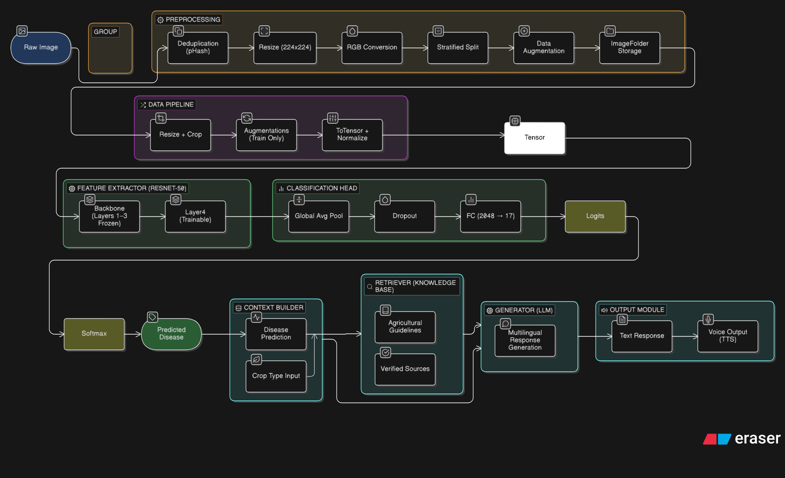
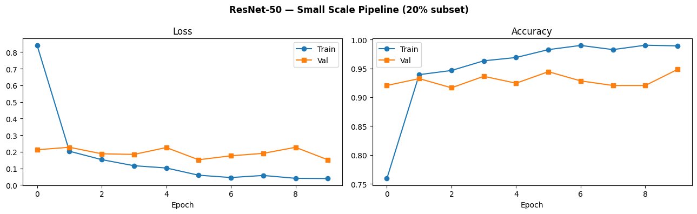
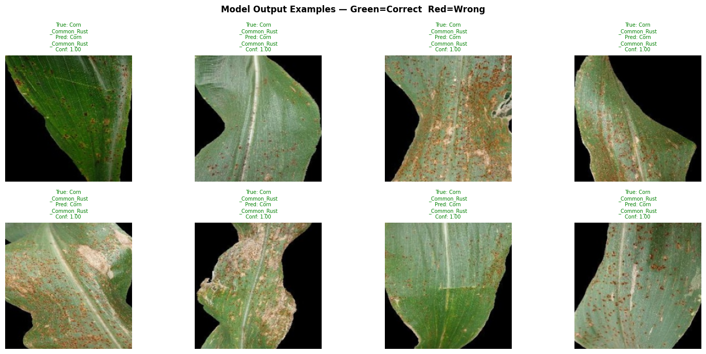

# Milestone 3 Report  
### Model Architecture, Data Pipeline & System Verification

---

## 1. Dataset Organization

### 1.1 Raw Dataset Structure

```
CropDisease/raw/
└── Crop Diseases/
    ├── Corn__Common_Rust/
    ├── ...
    └── Wheat__Yellow_Rust/
```

- Total images: ~13,324  
- Classes: 17  
- Crops: Corn, Potato, Rice, Wheat, Sugarcane  
- Formats: JPG, PNG, BMP, TIFF  
- Class imbalance: up to ~8×  

---

### 1.2 Processed Dataset Structure

```
CropDisease/processed/
├── train/
├── val/
└── test/
    └── ClassName/
```

- Standard ImageFolder format  
- Compatible with PyTorch loaders  
- Includes preprocessing_manifest.csv  

---

### 1.3 Train/Val/Test Split

| Split | Ratio | Purpose |
|------|------|--------|
| Train | 80% | Training |
| Val | 10% | Tuning |
| Test | 10% | Final evaluation |

- Stratified split ensures all classes are represented  
- Seed = 42 (reproducibility)  

---

## 2. Preprocessing Pipeline

### 2.1 Data Cleaning
- Exact duplicate removal (MD5)  
- Near-duplicate removal (pHash)  

### 2.2 Image Standardization
- Resize → 224×224 (LANCZOS)  
- Convert → RGB (3-channel)  

### 2.3 Class Imbalance Handling
- Augmentation applied only to training set  
- Target: ~700 samples for minority classes  

Augmentations:
- Flip (H/V)  
- Rotation (0–270°)  
- Brightness/contrast/saturation  
- Zoom crop  

---

### 2.4 Normalization (M3 Stage)

```
Mean: [0.485, 0.456, 0.406]
Std:  [0.229, 0.224, 0.225]
```

Ensures compatibility with pretrained ResNet-50  

---

## 3. Model Architecture

### 3.1 Overview

Model: ResNet-50 (pretrained, fine-tuned)  



---

### 3.2 Major Components

1. Input Layer  
- Shape: (N, 3, 224, 224)  

2. Feature Extractor (Backbone)  
- layer1–layer3 → Frozen  
- layer4 → Trainable  

3. Classification Head  
- Global Average Pool → (N, 2048)  
- Dropout (0.3)  
- Fully Connected → (2048 → 17)  

4. Output  
- Logits → Softmax → Class prediction  

---

### 3.3 Fine-Tuning Strategy

- Frozen layers → general features  
- Trainable layers → disease-specific features  

Trainable parameters: ~6.5M  

---

## 4. Data Flow (End-to-End)


Flow:

```
Raw Image → Preprocessing → Transform Pipeline → Tensor
→ ResNet-50 → Classification Head → Prediction
```

---

## 5. Input Format & Compatibility

| Property | Value |
|--------|------|
| Shape | (N, 3, 224, 224) |
| Format | Channels-first (PyTorch) |
| Type | float32 |
| Range | ~[-2.1, 2.6] |

---

### Why it matches ResNet

- Fixed size 224×224  
- RGB channels  
- ImageNet normalization  
- Channels-first format  

---

## 6. Architecture Justification

### Why ResNet-50

- Strong transfer learning performance  
- Stable deep network (skip connections)  
- Well-tested on classification tasks  
- Suitable for dataset size  

---

### Comparison

| Model | Limitation |
|------|-----------|
| VGG | Too many params |
| MobileNet | Lower accuracy |
| EfficientNet | Complex tuning |
| ViT | Needs large dataset |

---

### Limitations

- Background bias  
- Class imbalance  
- Limited dataset size  

---

## 7. Pipeline Verification

Steps verified:

1. Load image  
2. Apply transforms  
3. Forward pass  
4. Generate prediction  

Result:

- End-to-end pipeline works  
- Output shape: (N, 17)  
- Correct class mapping  

### 7.1 Training Curves



The training and validation curves show rapid convergence and stable learning behavior. Training loss decreases consistently while validation loss remains stable, indicating effective learning without significant overfitting. The small gap between training and validation accuracy suggests good generalization.

---

## 8. Example Outputs

Example:

```
Input Image: Corn leaf  
Predicted Class: Corn__Common_Rust  
Probabilities: [0.02, 0.91, 0.03, ...]
```

### 8.1 Sample Predictions



The model demonstrates high confidence and consistent predictions for visually distinct classes such as Corn Common Rust. The predictions remain accurate across variations in leaf orientation, lighting, and disease spread, indicating strong feature extraction and generalization.

---

## 9. Loss Function & Metrics

### Loss
- CrossEntropyLoss  

### Metrics
- Accuracy  
- Precision  
- Recall  
- F1-score  
- Confusion Matrix  
