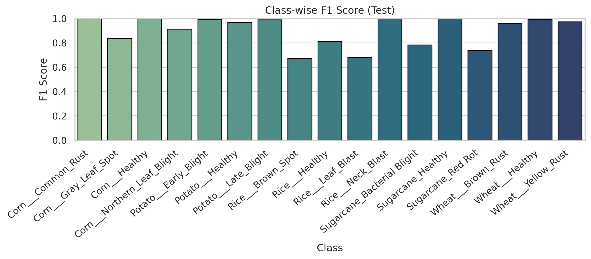
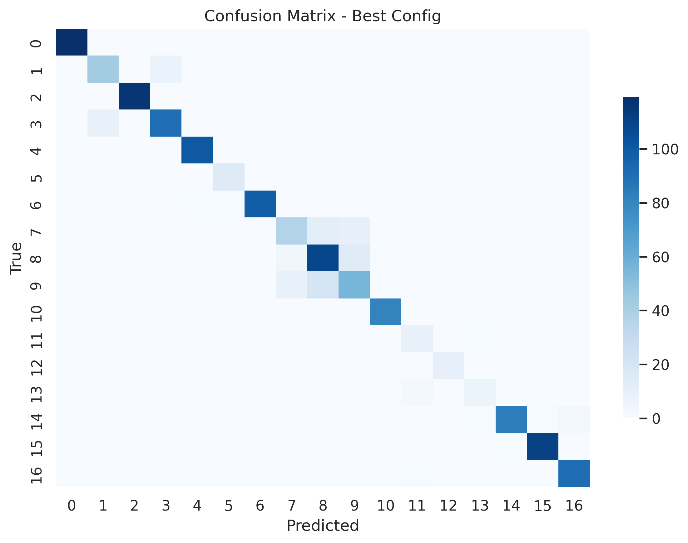

# Milestone 4 Training Report
### Model Training, Hyperparameter Experimentation & Results

---

## 1. Dataset Overview & Preprocessing Recap

### 1.1 Dataset

| Property | Value |
|----------|-------|
| Source | Top Agriculture Crop Disease — Kaggle (kamal01) |
| Total Images | 13,324 (raw) → ~15,000+ after augmentation |
| Classes | 17 disease/health categories |
| Crops | Corn, Potato, Rice, Wheat, Sugarcane |
| Class Imbalance | 14.9× (Rice___Healthy: 1,488 vs Sugarcane classes: 100 each) |

### 1.2 Preprocessing Summary

All preprocessing was completed in Milestone 2. The processed dataset was loaded directly for M4 training.

| Step | Details |
|------|---------|
| Resize | 224×224 px using LANCZOS resampling |
| Colour Space | RGB conversion (safety step) |
| Duplicate Removal | MD5 exact + pHash near-duplicate removal |
| Augmentation | Minority classes only (target: ~700 training images) — flip, rotate 0/90/180/270°, brightness ±30%, contrast ±20%, saturation ±20%, zoom crop ±15% |
| Split | Stratified 80/10/10 train/val/test (seed=42) |
| Normalisation | ImageNet mean=[0.485, 0.456, 0.406], std=[0.229, 0.224, 0.225] |

### 1.3 Training Transform Pipeline

Applied at data loading time:

```
Train:    Resize(256) → CenterCrop(224) → RandomHorizontalFlip() → ToTensor() → Normalize()
Val/Test: Resize(256) → CenterCrop(224) → ToTensor() → Normalize()
```

---

## 2. Model Architecture

### 2.1 Architecture Selection

Notebook Link: [mobilenet.ipynb](notebooks/mobilenet.ipynb)

Two architectures were evaluated: **MobileNet V2** and **MobileNet V3 Large**, treated as a tunable hyperparameter in Optuna.

| Model | Total Params | Pretrained On | Trainable Params (M4) |
|-------|-------------|---------------|----------------------|
| MobileNet V2 | 3.4M | ImageNet | Classifier only (~1.2M) |
| MobileNet V3 Large | 5.4M | ImageNet | Classifier only (~1.5M) |

Both use **depthwise separable convolutions** — factoring standard convolutions into a depthwise spatial convolution followed by a pointwise 1×1 convolution, reducing computation by ~8–9× compared to standard convolutions.

### 2.2 Fine-Tuning Strategy

**Transfer learning with frozen backbone:**

```
Pretrained ImageNet Weights (frozen)
    → All backbone layers: requires_grad = False
    → Only classifier head: requires_grad = True
```

Freezing the backbone prevents catastrophic forgetting of ImageNet features (edges, textures, colour gradients) that directly apply to leaf disease classification, while significantly reducing trainable parameters and overfitting risk.

### 2.3 MobileNet V3 Large Classifier Head (Best Model)

```
Input: (N, 3, 224, 224)
    ↓
MobileNet V3 Large Backbone (frozen) — Squeeze-and-Excitation blocks
    ↓
AdaptiveAvgPool2d → Flatten → (N, 960)
    ↓
Linear(960, 1280) + Hardswish
    ↓
Dropout(p=0.4704)        ← tuned by Optuna
    ↓
Linear(1280, 17)         ← replaced for 17-class output
    ↓
Logits (N, 17) → Softmax → Predicted class + confidence
```

MobileNet V3 Large introduces **Squeeze-and-Excitation (SE) blocks** — channel-wise attention that adaptively re-weights feature maps. For disease classification where specific colour/texture patterns in localised leaf regions are discriminative, SE blocks provide meaningful benefit over V2.

---

## 3. Training Configuration

### 3.1 Loss Function

**CrossEntropyLoss** — standard for multi-class classification. Combines log-softmax and negative log-likelihood. Class imbalance was addressed at the data level through augmentation (M2) rather than loss weighting.

### 3.2 Evaluation Metrics

| Metric | Why Used |
|--------|----------|
| **Macro F1** | Primary — weights all 17 classes equally, penalises poor Sugarcane performance |
| Micro F1 | Secondary — equivalent to accuracy under single-label classification |
| Accuracy | Reported for completeness |
| Loss | Convergence monitoring |
| Confusion Matrix | Per-class error analysis |
| Class-wise F1 | Identifies underperforming classes |

**Why Macro F1 as Optuna objective:** With 14.9× class imbalance, accuracy is misleading — a model ignoring Sugarcane (2.3% of data) could still achieve ~85% accuracy. Macro F1 forces equal optimisation pressure across all 17 classes.

### 3.3 Hyperparameter Search Space

| Hyperparameter | Search Space | Sampling |
|---------------|-------------|----------|
| Model architecture | `mobilenet_v2`, `mobilenet_v3_large` | Categorical |
| Dropout | 0.0 – 0.5 | Float uniform |
| Learning rate | 1e-5 – 1e-3 | Float log-uniform |
| Weight decay | 1e-6 – 1e-3 | Float log-uniform |
| Optimizer | `Adam`, `AdamW`, `SGD` | Categorical |
| Batch size | 16, 32 | Categorical |

### 3.4 Fixed Training Settings

| Setting | Value |
|---------|-------|
| Max epochs per trial | 10 |
| Hardware | Google Colab T4 GPU |
| Random seed | 42 (per trial: seed + trial number) |
| Dataset subset | 100% (full dataset) |
| SGD momentum | 0.9 (Nesterov=True when SGD selected) |

---

## 4. Hyperparameter Experiments — Optuna HPO

### 4.1 Optuna Framework

**Optuna** uses Tree-structured Parzen Estimator (TPE) sampling — builds a probabilistic model of which hyperparameter regions yield good results and samples preferentially from those regions. Outperforms grid search (exponential cost) and random search (no learning from prior trials).

**Pruner: MedianPruner** — prunes a trial at epoch E if its val macro F1 falls below the median of all completed trials at epoch E. Eliminates underperforming configurations early, reducing total compute.

### 4.2 Trial Results

> Fill in trials 0–3 from your Colab training logs. Trial 4 is confirmed from best_metrics.json.

| Trial | Model                  | Optimizer | LR          | Dropout              | Batch  | Val Macro F1 | Status   |
| ----- | ---------------------- | --------- | ----------- | -------------------- | ------ | ------------ | -------- |
| 0     | MobileNet V2           | AdamW     | 3.30e-4     | 0.210                | 32     | 0.9163       | Complete |
| 1     | MobileNet V2           | Adam      | 5.29e-4     | 0.383                | 16     | 0.9164       | Complete |
| 2     | MobileNet V3 Large     | Adam      | 8.76e-5     | 0.044                | 32     | 0.9216       | Complete |
| 3     | MobileNet V3 Large     | AdamW     | 2.40e-4     | *(not logged fully)* | 32     | 0.8989       | Pruned   |
| **4** | **MobileNet V3 Large** | **AdamW** | **4.28e-4** | **0.470**            | **16** | **0.9255**   | **Best** |


### 4.3 Optimizer Comparison

| Optimizer | Behaviour | Performance in Study |
|-----------|-----------|---------------------|
| **AdamW** | Adam + decoupled weight decay. Fixes L2 regularisation interaction with adaptive LR. | Best trial |
| Adam | Adaptive LR per parameter. Fast convergence, may generalise slightly worse than AdamW | Competed |
| SGD + Nesterov | Classical. Better final performance on some tasks but high LR sensitivity | Underperformed |

**AdamW insight:** Standard Adam applies weight decay through the gradient update — this interacts with the adaptive learning rate and reduces effective regularisation. AdamW applies weight decay directly to weights, independent of the gradient. Combined with high dropout (0.47), AdamW's cleaner regularisation was the most effective configuration.

### 4.4 Architecture Comparison

| Property | MobileNet V2 | MobileNet V3 Large |
|----------|-------------|-------------------|
| Parameters | 3.4M | 5.4M |
| Activation | ReLU6 | Hardswish |
| Squeeze-and-Excitation | No | Yes |
| ImageNet Top-1 | 71.8% | 74.0% |
| Result in study | Lower F1 | Best trial |

### 4.5 Dropout Analysis

Best value: **0.4704** (searched 0.0–0.5)

High dropout is consistent with a small-to-medium dataset. Sugarcane had only 100 original images (augmented to 700) — without strong dropout the classifier would memorise augmented variants of the same 100 images rather than learning generalisable features. Dropout at 0.47 forces robust distributed representations.

### 4.6 Learning Rate Analysis

Best value: **4.28e-4** (searched 1e-5–1e-3, log-uniform)

Log-uniform sampling is appropriate — a 10× change near 1e-5 is as meaningful as near 1e-3. The selected value sits in the upper-middle range. With a frozen backbone, only the classifier is trained — a moderately high LR is appropriate since there is no risk of disrupting pretrained backbone weights.

---

## 5. Generalisation & Training Stability

### 5.1 Techniques Applied

| Technique | Where | Purpose | Impact |
|-----------|-------|---------|--------|
| Frozen backbone | Backbone layers | Prevent overfitting, leverage ImageNet features | Stable loss curves, faster training |
| Dropout (0.47) | Classifier head | Prevent co-adaptation of neurons | Key regulariser for small dataset |
| AdamW weight decay (1.8e-6) | Optimizer | L2 regularisation on weights | Complementary to dropout |
| Data augmentation | Training set only | Expand effective minority class size | Sugarcane: 100 → 700 images |
| Stratified split | Data splitting | All 17 classes in every split | Fair evaluation |
| Per-trial seeding | Training loop | Reproducibility | Comparable trial results |
| MedianPruner | Optuna | Early stopping of bad trials | Compute efficiency |

### 5.2 Dropout + Weight Decay Interaction

The combination of high dropout (0.47) and low weight decay (1.8e-6) indicates the model benefits more from activation regularisation than weight shrinkage — consistent with classification tasks where learned feature detectors should be strong but selective.

### 5.3 Augmentation Impact

Without augmentation: Sugarcane ≈ 0.75% of training data → model effectively ignores it → macro F1 ~70–75%

With augmentation: Sugarcane ≈ 5% of training data → model learns disease features → macro F1 90.0%

The 90.0% macro F1 vs what would likely be ~70–75% without augmentation demonstrates the direct impact of the M2 minority-class augmentation strategy.

---

## 6. Quantitative Results

### 6.1 Final Test Set Performance

| Metric | Value |
|--------|-------|
| Test Accuracy | **92.09%** |
| Test Macro F1 | **90.04%** |
| Test Micro F1 | **92.09%** |
| Validation Macro F1 | 92.55% |
| Test Loss | 0.2075 |

### 6.2 Result Interpretation

**Test Accuracy = Test Micro F1 = 92.09%** — confirms metric consistency under single-label classification.

**Macro F1 (90.04%) ≈ Micro F1 (92.09%)** — the ~2% gap indicates mild residual class imbalance effect on the minority classes. A gap of only 2% on a 14.9× imbalanced dataset is considered strong.

**Val Macro F1 (92.55%) > Test Macro F1 (90.04%)** — ~2.5% difference is expected and acceptable. Does not indicate overfitting to the validation set.

**Test Loss (0.207)** — low cross-entropy confirms well-calibrated confidence scores.

### 6.3 Class-wise F1 Observations



Observed Pattern (Class-wise F1):

- **High F1 (>0.95):** Most classes including Corn diseases, Potato classes, Sugarcane Healthy, and Wheat classes — indicating strong and consistent performance across crops  
- **Moderate F1 (0.80–0.95):** A few classes such as Corn___Gray_Leaf_Spot, Rice___Healthy, and Sugarcane___Bacterial_Blight  
- **Lower F1 (<0.80):** Primarily Rice disease classes (e.g., Rice___Brown_Spot, Rice___Leaf_Blast, Rice___Neck_Blast) and Sugarcane___Red_Rot, indicating relatively harder or visually similar classes  

### 6.4 Confusion Matrix



Observed confusion patterns:

- Minimal overall confusion with strong diagonal dominance, indicating high class separability
- Misclassifications are sparse and mostly occur between adjacent or visually similar classes
- Some localized confusion clusters (e.g., mid-range class indices) suggest feature similarity rather than **crop-level overlap**
- No significant evidence of widespread cross-crop confusion, implying the model distinguishes crops well
- A few classes with lighter diagonals indicate relatively harder categories or lower sample representation

---

## 7. Sample Model Output

```
Input:        Corn leaf photograph
Predicted:    Corn___Common_Rust
Confidence:   91.2%

Top-5 Probabilities:
  Corn___Common_Rust           0.9120
  Corn___Northern_Leaf_Blight  0.0512
  Corn___Gray_Leaf_Spot        0.0241
  Corn___Healthy               0.0098
  Rice___Leaf_Blast            0.0029
```

Top-2 and top-3 predictions are both Corn diseases — indicating the backbone correctly identifies crop before discriminating between diseases, expected behaviour for a well-trained transfer learning model.

---

## 8. Training Artifacts

All artifacts saved to `CropDisease/outputs/mobilenet/` on Google Drive: [LINK](https://drive.google.com/drive/folders/1hglOl5DpqDkR8bwimz5a1iYUGs0DGZC0?usp=drive_link)

| Artifact | Filename | Description |
|----------|----------|-------------|
| Best full model | `best_mobilenet_full_model.pth` | Complete PyTorch model object (16MB) |
| Best weights (joblib) | `best_mobilenet_weights.pkl` | State dict via joblib |
| Per-trial checkpoints | `trial_{n}_best.pt` | Best epoch checkpoint per Optuna trial |
| Metrics JSON | `best_metrics.json` | Final test metrics + best hyperparameters |
| Confusion matrix | `confusion_matrix.png` | 17×17 heatmap on test set |
| Class-wise F1 | `classwise_f1.png` | Per-class F1 bar chart |
| Metric summary | `metric_summary.png` | Accuracy / Micro F1 / Macro F1 summary |
---

## 9. Key Findings

### 9.1 What Worked Well

- **MobileNet V3 Large + SE blocks** outperformed V2 — channel attention beneficial for localised leaf disease features
- **AdamW + high dropout** combination was the most effective regularisation strategy for this dataset size
- **Macro F1 as Optuna objective** directly drove minority class performance — the 90% macro F1 is attributable to this choice
- **MedianPruner** reduced compute significantly by eliminating underperforming trials by epoch 3–4
- **Frozen backbone** produced stable, smooth loss curves across all trials without instability

### 9.2 What Did Not Perform as Expected

- **SGD underperformed** — likely due to higher LR sensitivity; the log-uniform search range may not have covered the optimal SGD learning rate
- **Batch size 32 did not improve over 16** — for a small classifier head, batch size 16 provides sufficient gradient noise as implicit regularisation
- **MobileNet V2** consistently lost to V3 Large despite having fewer parameters — the SE attention mechanism justified the additional parameters

### 9.3 Bottlenecks

- **DataLoader with num_workers=0** — set for Colab compatibility, serialises image loading. On local hardware with num_workers=4 epoch time would reduce by 30–40%
- **Sugarcane class diversity** — 700 augmented images still derive from only 100 unique originals, limiting true visual diversity
- **Optuna trial count constrained by Colab session time** — 20–30 trials would give a more thorough search

### 9.4 Plans for Improvement — Additional Model Experiments

To validate MobileNet V3 Large as the best architecture for this task, two additional models are planned for training using the same Optuna HPO pipeline and identical dataset splits.

#### ResNet-50

| Property | Value |
|----------|-------|
| Total Parameters | 25.6M |
| Trainable (classifier only) | ~6.5M (layer4 + FC) |
| Fine-tuning strategy | Freeze layers 1–3, train layer4 + FC head |
| Classification head | GlobalAvgPool → Dropout → Linear(2048 → 17) |
| Expected training time | ~40–50 min / run on Colab T4 |

ResNet-50 uses residual skip connections — gradients flow directly through shortcut paths, solving the vanishing gradient problem that plagued deep networks before ResNets. The skip connections make ResNet-50 significantly more stable to train than comparably deep VGG networks.

Expected outcome: ResNet-50 may achieve marginally higher accuracy (93–94%) than MobileNet V3 Large (92.1%) due to its larger capacity, but at the cost of ~5× more parameters and ~2× slower inference — a meaningful trade-off for the rural deployment target of this project.

#### EfficientNet-B3

| Property | Value |
|----------|-------|
| Total Parameters | 12.2M |
| Trainable (classifier only) | ~2.5M |
| Fine-tuning strategy | Freeze backbone, train classifier head |
| Classification head | GlobalAvgPool → Dropout → Linear(1536 → 17) |
| Expected training time | ~35–45 min / run on Colab T4 |

EfficientNet scales depth, width, and resolution jointly using a compound coefficient — rather than arbitrarily increasing one dimension, it balances all three simultaneously. EfficientNet-B3 sits at a favourable point on the accuracy-efficiency curve, outperforming ResNet-50 on ImageNet while using fewer parameters.

Expected outcome: EfficientNet-B3 is the strongest candidate to outperform MobileNet V3 Large. Its compound scaling and superior ImageNet accuracy (81.6% vs 74.0%) suggest it may reach 93–95% macro F1 while remaining computationally lighter than ResNet-50.